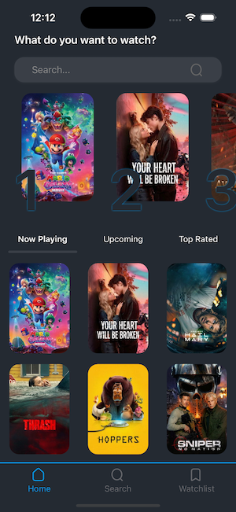
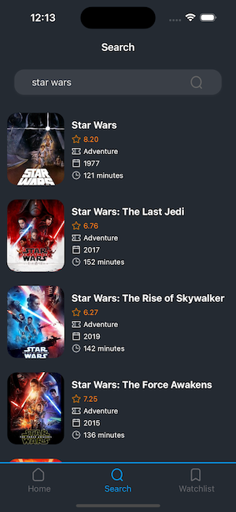
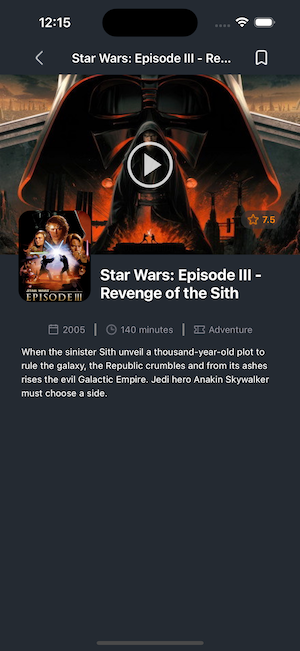

# MovieDB

A React Native app build with Expo that integrates TMDB API and is designed with an offline-first approach.





## Get started

1. Install dependencies

   ```bash
   npm install
   ```

2. Make sure to provide you TMDB API in .env file

   ```bash
   EXPO_PUBLIC_API_URL=https://api.themoviedb.org/3
   EXPO_PUBLIC_API_ACCESS=your_api_key
   ```

3. Start the app

   ```bash
   npx expo start
   ```

In the output, you'll find options to open the app in a

- [development build](https://docs.expo.dev/develop/development-builds/introduction/)
- [Android emulator](https://docs.expo.dev/workflow/android-studio-emulator/)
- [iOS simulator](https://docs.expo.dev/workflow/ios-simulator/)
- [Expo Go](https://expo.dev/go), a limited sandbox for trying out app development with Expo

## Features

- Advanced caching strategy
  - SWR strategy
  - query level TTL to reduce api calls
  - persistent cache across restarts

- Image optimization (memory+disk)
  - low latency memory caching
  - reliable when offline disk caching

- Network awareness
  - Detects offline state
  - pause queries on disconnect
  - refetch on reconnect

## Tech Stack

| Library        | Purpose                                        |
| -------------- | ---------------------------------------------- |
| Expo 54        | Core platform library                          |
| Expo-router    | Handles file based navigation                  |
| Axios          | HTTP client handles API layer                  |
| TanStack Query | Handles server state caching                   |
| AsyncStorage   | Persist cached server state                    |
| expo-image     | Handles cache for images (disk)                |
| expo-sqlite    | Handles offline storage of watchlisted items   |
| NetInfo        | Subscribes to network changes to show an alert |

## Improvements

- Fully test different video request sites. Currently only YouTube is supported.(no other site was documented)
- Local search fallback to cached content when offline
  > can be done with useNetwork hook and deffer the query to local data instead of TMDB API when offline
- Infinite scrolling with pagination
  > Tanstack useInfiniteQuery can handle pagination coordination with a simple change
- Use of react-native-mmkv to faster storage read/write
  > can be easily done by implementing an adapter for setItem, getItem, removeItem and entries to use mmvk.
- Implement full Auth client to allow more API features within TMDB
  > instead of directly using an Api Access Token, first use API Key to request an access token
